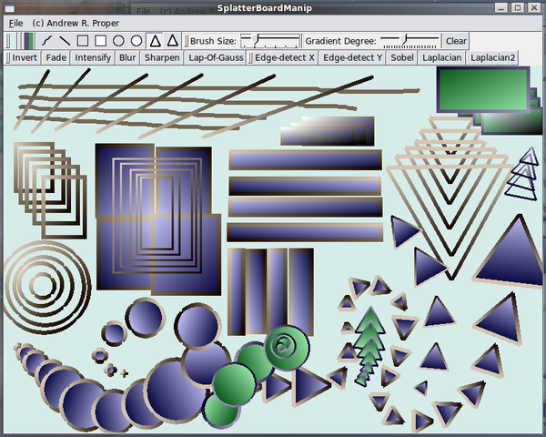
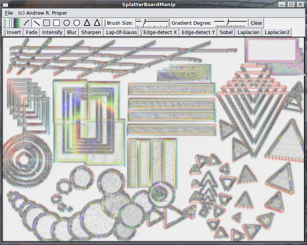
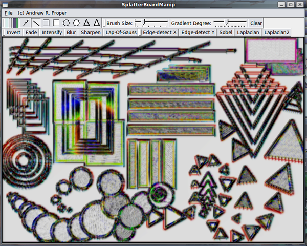
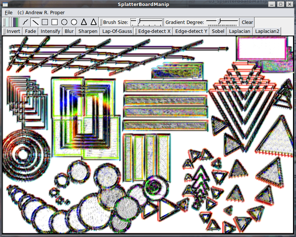
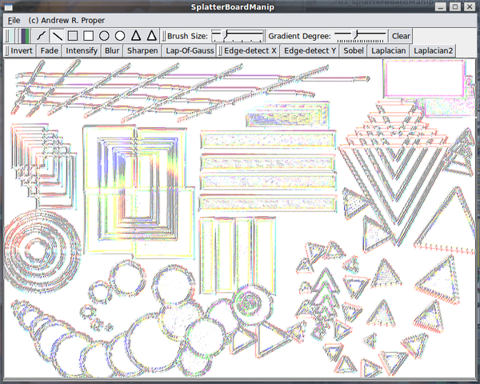
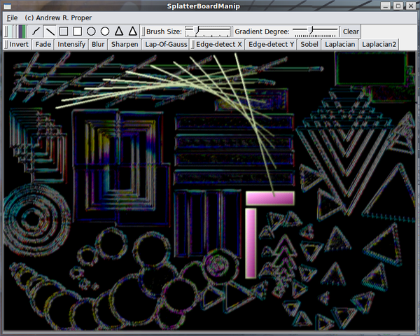

# SplatterBoardManip

*A painting and image manipulation program created using C++, OpenGL, and QT3.*

Copyright 2002 Andrew R. Proper

---

SplatterBoardManip features drawing tools including point, line, 
square, circle, and triangle. It also features image manipulation 
tools which filter the image to create a unique result. The drawing 
tools have adjustable colour, brush size, and gradient degree. The 
image created can be saved in common image formats, and can be 
re-opened later for further modification.
 
This program was written for my Computer Graphics class in 2002. In this 
class my final grade was 99%. I thoroughly enjoy graphics programming.

---



*Drawing with the drawing tools.*

---



*The image manipulation tools were used to edge-detect, blur, lap-of-gauss, and fade the image.*


---



*Multiple intensifies bring the colours more into the foreground.*


---



*More lap-of-gauss and edge detection clarifies the image.*


---



*Dimming using fade.*


---



*Adding lines and rectangles with drawing tools, then inverting the image.*


---


## Dependencies

  - C++ compiler
  - OpenGL
  - QT3

## Compiling

To compile and run this program
type ```qmake splatterBoardManip.pro``` and then ```make```.

qmake will read the splatterBoardManip.pro file
and generate an appropriate makefile.


